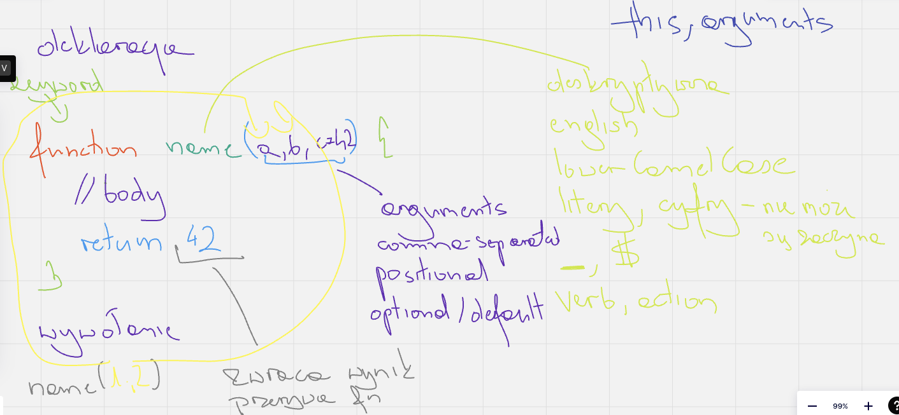

# JS notes

## Variables

Różnice |       var       | let | const
---: |:---------------:| :---: | :---:
redeclaration | + (quirks mode) | - | -
re-assignment |        +        | + | - 
hosting | + | + (TDZ) | + (TDZ)
scope | function | block | block

---
## Functions

1. Named Functions
2. Anonymous Functions
    - classic
    - arrow function

---
## Logic

x | y | AND &&
:---: | :---: | :---:
1 | 1 | 1
1 | 0 | 0
0 | 1 | 0
0 | 0 | 0

x | y | OR 
:---: | :---: | :---:
1 | 1 | 1
1 | 0 | 1
0 | 1 | 1
0 | 0 | 0

[Prawa de Morgana](https://pl.wikipedia.org/wiki/Prawa_De_Morgana)